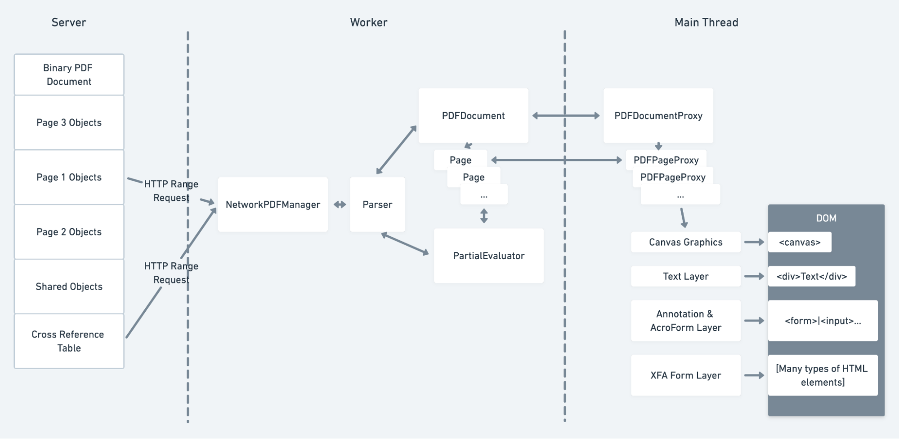

# PDF.js Architecture

[Read more](https://hacks.mozilla.org/2021/10/implementing-form-filling-and-accessibility-in-the-firefox-pdf-viewer/)

[comment]: <> (## Glossary)

[comment]: <> (- PDFJSDev)
